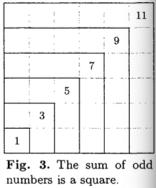

This is pure mathematic part of that volume.

# 1.2.1 Mathematical Induction
Let `P(n)` be some boolean expression. It takes `n` and return boolean. For example `P(n)` is that "n times (n + 3) is and even number" etc. Suppose that we want to **prove** that `P(n)` is `true` for all positive integers n. *Important way* of doing this is:

> In future of this synops the P.n is identical to P(n)

### First Example
1. Proof that `P.1` is true
2. Proof that "if all P.1, P.2, ..., P.n" are true, then `P.n+1` is also true.

If
```
1 = 1^2
1 + 3 = 2^2
1 + 3 + 5 = 3^2
1 + 3 + 5 + 7 = 4^2
...
```
Can we prove the general property (**EQ.2**):
```
1 + 3 + ... + (2n - 1) = n^2
```
Call above formulation as `P.n`. We wich to prove that `P.n` is tru for all positive `n`. Let's go step by step:
a. P.1 is true since 1 = 1^2
b. If all of `P.1, ..., P.n` are true, then `P.n` is true, so EQ.2 holds. Therefore we can add `2n + 1` to both sides and obtain:
```
1 + 3 + ... + (2n - 1) + (2n + 1) = n^2 + 2n + 1 = (n + 1)^2
```
which proves that `P.n+1` is also true
> we can regard this method as an algorithmic proof precedure

**Algorithm I** (construct a proof). Given a positive integer n, this algorithm will output a proof that `P.n` is true.
1. [Prove `P.1`]. Set k <- 1 and according to (b) output a proof of `P.1` (1 = 1^2)
2. [k = n?] if true, then terminate algorithm; the required proof has been output.
3. [Prove P.k+1]. according to (a) proof that. We determine that P.1 is true, go further for 2,3,4,...,n
4. [Increase k]. Increase k by 1 and go to step 2.

> Such proof technique based on steps (a) and (b) is logically valid and called *proof by methematical induction*.

> induction is no more than our best guess about the situation; mathematicans would call it an empirical result or conjecture



### Second Example
Let `p.n` denote the number of partitions of n. For example 5 can be partitioned in exactly seven ways:
```
1+1+1+1+1
2+1+1+1
2+2+1
3+1+1
3+2
4+1
5
```
we have `p.5 = 7`. First few values of `p`:
```
p.1 = 1
p.2 = 2
p.3 = 3
p.4 = 5
p.5 = 7
```
At this point we can tentatively formulate, **by induction**, the hypotesis that the sequence of `p.2,p.3...` runs through the *prime numbers*.

Mathematical induction in its sense is different from out explanation. It isn't just guessing work, but a conclusive proof of a statement.

> it is proof of infinetely many statements, one for each `n`

> it has been called "induction" only because one must first decide somehow *what* is to be proved, *before* one can apply the technique of mathematical induction.

What does it mean? It means that first we need to decide what to prove, and then prove it step by step.

### Fibonacci sequence
Define it by `F0, F1, F2, ...` by the rule that `F0 = 0, F1 = 1, Fn = F(n-1) + F(n-2)`. We will prove that if `f` is the number `(1 + 5^(1/2))/2` we have
```
Fn =< f^(n - 1)
```

for all positive integers n. Call this formula `P.n`. Similar to previous `P.n`, lets prove (a):
If `n = 1`, then `F1 = 1 = f^0 = f^(n - 1)`.

Step (b):
For `P.2` we have `F2 = 1 < 1.6 <(=) f^1 = f^(2-1)`.

Now if all of `P.1, P.2, ..., P.n` are true and `n > 1` we know particular that `P.n-1` and `P.n` are true

> P.n-1 is true because P.n is true - induction is step by step

So `F.(n-1) =< f^(n-2)` Assuming this we have:
```
F.(n+1) = F.(n-1) + F.n // it is definition if F.n

F.(n+1) = F.(n-1) + F.n =< f^(n-2) + f^(n-1) // new part is reasonable because of P.n

F.(n+1) = F.(n-1) + F.n =< f^(n-2) + f^(n-1) = f^(n-2)(1 + f)

because 1 + f = f^2 - property of f

f^(n-2) * f^2 = f^n

F.(n+1) =< f^n // we start from this, this is P.n
```

So we complete the step (b): prove that `F.(n+1) =< f^n` from `F.n =< f^(n-1)` or `P.(n+1)` from `P.n`

### Generalization of Euclid's algorithm
By given `m` and `n` we compute their greates common divisor `d` and two integers `a` and `b`, such that `am + bn = d`
1. [Init] a' <- b <- 1, a <- b' <- 0, c <- m, d <- n
2. [Divide] Let q and r be the quotient and remainder, respectively, of c divided by d. (c = qd + r and 0 =< r < d)
> q = c `div` d; r = c `mod` d
3. [Remainder zero?] If r = 0, then terminate. we have desired result: `am + bn = d` or `0m + 1n = d` where `d = n`
4. [Recycle] c <- d, d <- r, t <- a', a' <- a, a <- (t - qa), t <- b', b' <- b, b <- (t - qb), goto 2.

> c <- d and d <- r means exchange of m and n. c and d are just auxilary copies of m and n

The purpose is to prove that algorithm works correctly for all m and n. First prove that:
```
a'm + b'n = c, am + bn = d
```

### EXERCISES
1. In case of `1 + 3 + ... + (2n - 1) = n^2`.
```
P.0 = 1 = 0^2 - true
```
And then continue as follow - you can add `(2n + 1)` to both sides or just calculate the boolean status of this expression for `n=1,n=2...`. I don't think that this matters. We could start from `n=3`, the only condition is that `n` must be in input-range of `P`.

2. First, in equation for `a^(n+1)` (which is `a^)(n-1) + 1)`). Which `a^n` is equal to middle part of this equation? I checked this and it isn't - the first missplacing.
Also, is in this example we use the same algorithm for prooving `P.0` and `P.1`. What is the algorithm for `P.0`? Just get the exponent and compare with `0`. What we do for `P.1`. Well there is a mess and I assume that it isn't just getting exponent and compare with `0` But should they be equal?

What is written in that equation? `a^n`, but it seems like that we first make it equal to `1` and then derive the sense of algorithm `a^n`.

For proove `P.n = 1 + 3 + ... + (2n - 1) = n^2` we work with that `P.n`. We calculate the `P.n` for `n=0` and etc. We add `(2n+1)` for both sides of `P.n` and made sure that sides are equal. In this example (if a = const) we got `P.n = a * a * a * ... - n times` and we should proove it but not some fancy equation that we construct to be equal the desired result.

3. If proof the man found that for `n = 1` the `3/2 - 1/n = 1/(1 * 2)` but that isn't true. The left hand side here isn't for `n = 1` is is for `n = 2`. In all, `1` isn't the member of `P.n` function - the input starts from `2`.

I made such conclusion becase:

First. if we pass `n = 2` from `1/((n-1) * n)` we get `1/(1 * 2)` and hence we should write `1/2 + 1/2` but it isn't our sequence.

Second. if from `1/((n-1) * n)` we should get `1/2` for `n = 1` that it fails and I assume that `1` isn't in input-set of that algorithm.

4. Follow the `F.n =< f^(n-1)` proof or look at my notebook.

5. `P.n` is an algorithm that output boolean:
`true` if `n` can be represented as a product of one or more prime numbers and `false` if cannot. `n` must be > 1. 
```
Base: P.2 = true
Assume: P.n is holds for n =< N
If N is prime then it is true
Else n = a * b, where a,b < N
```